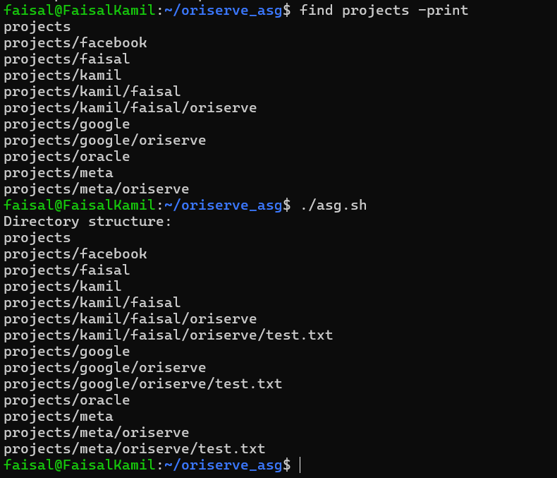

# Oriserve Directory Automation Task

This project contains a shell script to automate the creation of project directories, identify specific subdirectories named `oriserve`, and create a `test.txt` file within those subdirectories.

## Task Overview

The goal of this task is to:
1. Create a set of project directories, some of which contain a folder named `oriserve`.
2. Automatically locate the `oriserve` directories within the project structure.
3. Create a `test.txt` file inside each `oriserve` directory.

### Directory Structure

After running the shell script, the directory structure will look like this:

```bash
projects/
├── facebook
├── google
│   └── oriserve
│       └── test.txt
├── meta
│   └── oriserve
│       └── test.txt
└── oracle
```

## Commands for that
```bash
git clone https://github.com/faisalkamilansari/oriserve_task_2.git
cd oriserve_task_2
sudo chmod +x make_dir.sh asg.sh
./make_dir.sh # for making directory only (Without test.txt)
./asg.sh # for finding the 'oriserve' and making test.txt inside it
```
### Screenshots

Here are screenshots showing the structure after running the script:


